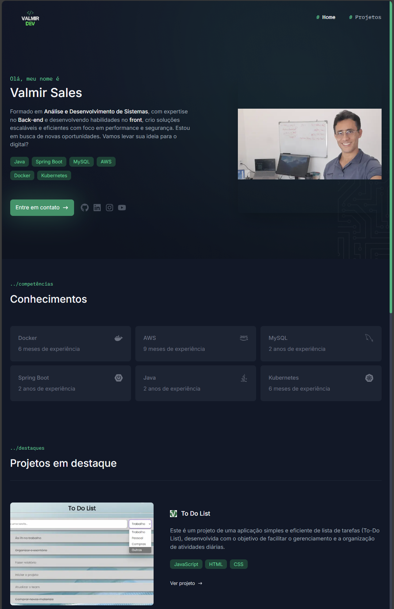

<h1 align="center">Portfólio</h1>

#### Autor

# Template Portfólio

"Este é o template que utilizei para criar meu portfólio com as ferramentas mais recentes de desenvolvimento web. O template inclui Next.js 13, Tailwind CSS, TypeScript e Framer Motion. Na primeira versão, sua estrutura consumia dados dinâmicos via CMS do Hygraph; agora, está reestruturado para consumir dados estáticos."

[**Demonstração do Projeto**](https://valmirdev-portfolio.vercel.app/)

[**Referência do Projeto**](https://github.com/GBDev13/portfolio-tutorial-2023)
